<h2>TensorFlow-FlexUNet-Image-Segmentation-Brain-Tumor-Consolidated-MRI (2026/06/27)</h2>
Sarah T.  Arai 
Software Laboratory antillia.com  
This is the first experiment of Image Segmentation for
<a href="https://www.kaggle.com/datasets/ramanarasimhakanduri/brain-tumour-dataset">
 <b>Brain Tumor MRI Dataset: Consolidated, Cleaned & Deduplicated</b> 
</a> based on our <a href="./src/TensorFlowFlexUNet.py">TensorFlowFlexUNet</a> 
(TensorFlow Flexible UNet Image Segmentation Model for Multiclass) , 
and a 512x512 pixels PNG
<a href="https://drive.google.com/file/d/1VH8U-81d4giGFCRobXS0-FHS5mjOXdX4/view?usp=sharing">
<b>Brain-Tumor-Consolidated-MRI-ImageMask-Dataset.zip</b></a> with colorized masks 
(<a href="https://creativecommons.org/publicdomain/zero/1.0/">CC0: Public Domain</a>), which was derived by us from   
<a href="https://www.kaggle.com/datasets/ramanarasimhakanduri/brain-tumour-dataset">
<b>Brain tumour dataset</b> </a> by Rama Narasimha Kanduri and 1 collaborator.
  

<b>Actual Image Segmentation for Brain-Tumor-Consolidated-MRI Images of 512x512 pixels </b> 
As shown below, the inferred masks predicted by our segmentation model trained by the dataset appear similar to the ground truth masks.
  
<b>class_color_map = {Meningioma:blue, Glioma:green, Pituitary tumor:red}
</b>
  
<table>
<tr>
<th>Input: image</th>
<th>Mask (ground_truth)</th>
<th>Prediction: inferred_mask</th>
</tr>
<tr>
<td>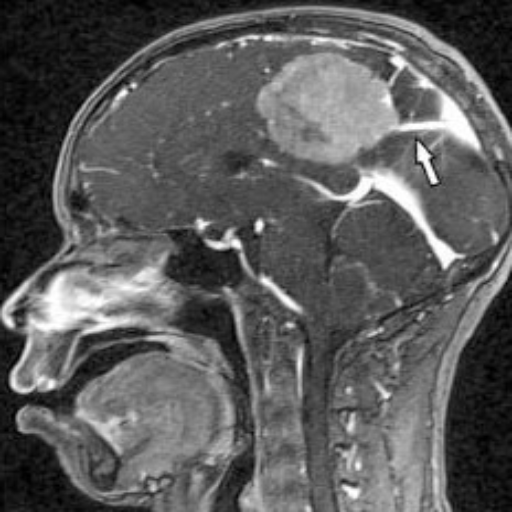</td>
<td></td>
<td>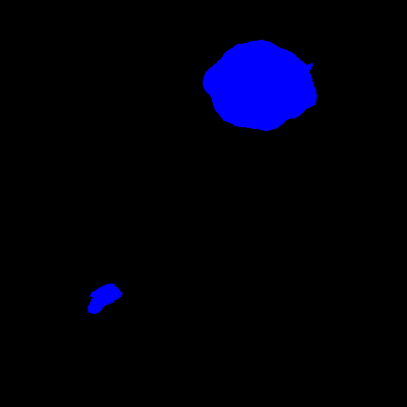</td>
</tr>
<tr>
<td>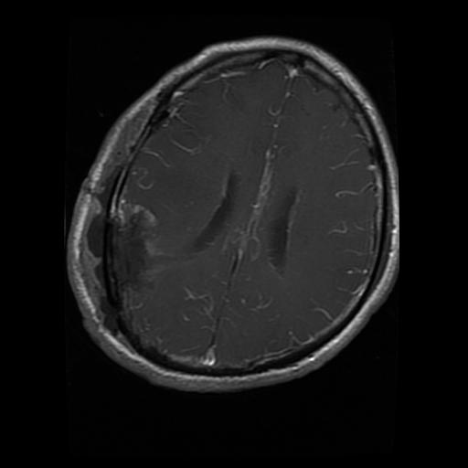</td>
<td>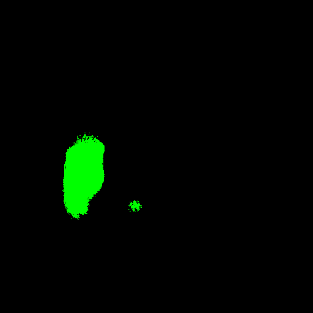</td>
<td>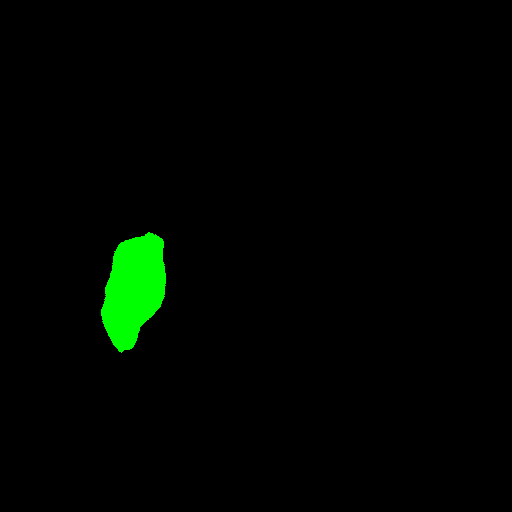</td>
</tr>
<tr>
<td>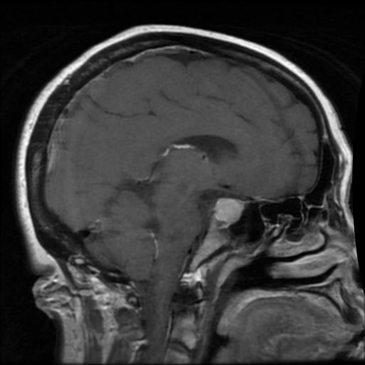</td>
<td></td>
<td></td>
</tr>
</table>

 
<h3>1  Dataset Citation</h3>
The dataset used here was derived from   
<a href="https://www.kaggle.com/datasets/ramanarasimhakanduri/brain-tumour-dataset">
<b>Brain tumour dataset</b> </a> by Rama Narasimha Kanduri and 1 collaborator.
  
The following explanation was taken from above web site.
  
<b>About Dataset</b> 
<b>Brain Tumor MRI Dataset: Consolidated, Cleaned & Deduplicated</b> 
 
<b>Overview</b> 
This dataset was created by merging two widely recognized brain MRI classification datasets and applying a rigorous deduplication pipeline to eliminate redundant scans and reduce the risk of data leakage.
  
The result is a larger, cleaner, and more reliable dataset containing 6,892 unique brain MRI images across four diagnostic categories:
<ul>
<li>
<b>Glioma</b>
</li>
<li>
<b>Meningioma</b>
</li>
<li>
<b>Pituitary Tumor</b>
</li>
<li>
<b>No Tumor (notumor)</b>
</li>
</ul>
This dataset is designed for researchers, students, and practitioners working on medical image classification, 
computer vision, explainable AI, and deep learning applications in healthcare.
  
<b>Source Datasets</b> 
<b>1. Brain Tumor MRI Dataset</b> 
Created by Masoud Nickparvar, this is one of the most widely used public brain 
MRI datasets for multi-class tumor classification. It contains MRI scans categorized into: 
<ul>
<li>Glioma</li>
<li>Meningioma</li>
<li>Pituitary Tumor</li>
<li>No Tumor</li>
</ul>
<b>2. BRISC 2025 Dataset (Classification Track)</b> 
A recently released brain MRI classification dataset developed for the BRISC 2025 challenge. 
The dataset provides additional MRI scans that increase both sample diversity and dataset scale.
  
<b>Dataset Consolidation</b> 
The two source datasets were merged into a single unified collection. 
During the consolidation process: 
<ul>
<li>
All MRI images from train and test folders were combined into one dataset pool.
</li>
<li>Label naming inconsistencies were standardized.
</li>
<li>All healthy brain scans were mapped to a single class label: notumor.
</li>
<li>
Directory structures were unified to create a consistent classification dataset.
</li>
</ul>
This produced a significantly 
larger dataset suitable for custom train-test splitting, stratified sampling, or K-Fold cross-validation.
 
 
<b>Final Dataset Statistics</b> 
<table>
<tr>
<td><b>Class</b></td>
<td><b>Images</b></td>
</tr>
<tr><td>Glioma</td><td>1,734</td></tr>
<tr><td>Meningioma</td><td>1,625</td></tr>
<tr><td>No Tumor</td><td>1,870</td></tr>
<tr><td>Pituitary</td><td>1,663</td></tr>
<tr><td><b>Total</b></td><td><b>6,892</b></td></tr>
</table>
 
The dataset remains relatively balanced across all four classes, making it suitable for multi-class classification experiments.
  
<b>Citation</b> 
If you use this dataset in research or publications, 
please consider citing the original source datasets alongside this consolidated and deduplicated version.
  
<b>License:</b> 
<a href="https://creativecommons.org/publicdomain/zero/1.0/">CC0: Public Domain</a>
  
<h3>
2 Brain-Tumor-Consolidated-MRI ImageMask Dataset
</h3>
<h3>
2.1 Download ImageMask Dataset
</h3>
 If you would like to train this Brain-Tumor-Consolidated-MRI Segmentation model by yourself,
please down load our dataset <a href="https://drive.google.com/file/d/1VH8U-81d4giGFCRobXS0-FHS5mjOXdX4/view?usp=sharing">
<b>Brain-Tumor-Consolidated-MRI-ImageMask-Dataset.zip</b>
(<a href="https://creativecommons.org/publicdomain/zero/1.0/">CC0: Public Domain</a>)
</a> on the google drive,
expand the downloaded, and put it under <b>./dataset/</b> to be.
<pre>
./dataset
└─Brain-Tumor-Consolidated-MRI
    ├─test
    │   ├─images
    │   └─masks
    ├─train
    │   ├─images
    │   └─masks
    └─valid
        ├─images
        └─masks
</pre>
 
<b>Brain-Tumor-Consolidated-MRI Statistics</b> 
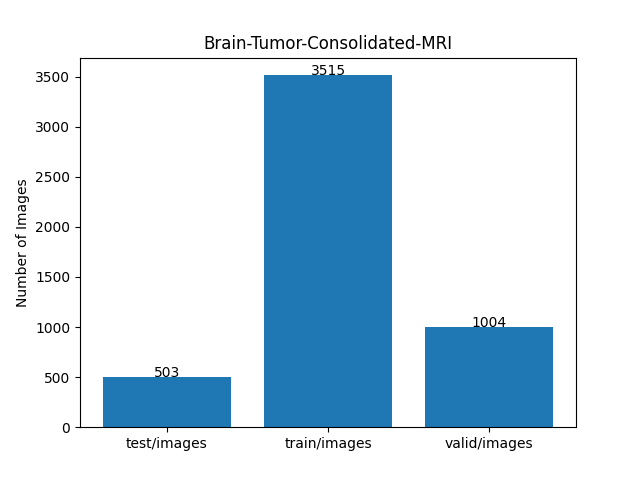 
 
As shown above, the number of images of train and valid datasets is large enough to use for a training set of our segmentation model.
  
<h3>
2.2 Derivation of Brain-Tumor-Consolidated-MRI Dataset
</h3>
The folder structure of the original <b>final_dataset_clean</b> is the following,
but it contains no annotation(mask) files,because it is an image classification dataset. 
<pre>
./final_dataset_clean
  ├─glioma
  │   ├─brisc2025_test_00001_gl_ax_t1.jpg
...
  │   └─Tr-gl_1394.jpg
  │
  ├─meningioma
  │   ├─brisc2025_test_00255_me_ax_t1.jpg
...
  │   └─Tr-me_964.jpg
  │
  ├─normal
  │   ├─brisc2025_test_00561_no_ax_t1.jpg
...
  │   └─Tr-no_1398.jpg
  │
  └─pituitary
       ├─brisc2025_test_00701_pi_ax_t1.jpg
...
       └─Tr-pi_1309.jpg
</pre>
<b>Step 1</b> 
We generated a 512x512 pixsels PNG master dataset from all JPG files under 
<b>glioma</b>, <b>meningioma</b> and <b>pituitary</b> folders.
  
<b>Step 2</b> 
We generated our own annotation (mask) files corresponding to the master PNG images 
by applying an inference (segmentation) method of
a pretrained FlexUNet model <a href="https://github.com/sarah-antillia/TensorFlow-FlexUNet-Image-Segmentation-BRISC2025-BrainTumor">
TensorFlow-FlexUNet-Image-Segmentation-BRISC2025-BrainTumor
</a> to all master images, without human annotation experts.
  
<h3>
2.3 Train Sample Images and Masks
</h3>
<b>Train_sample images</b> 
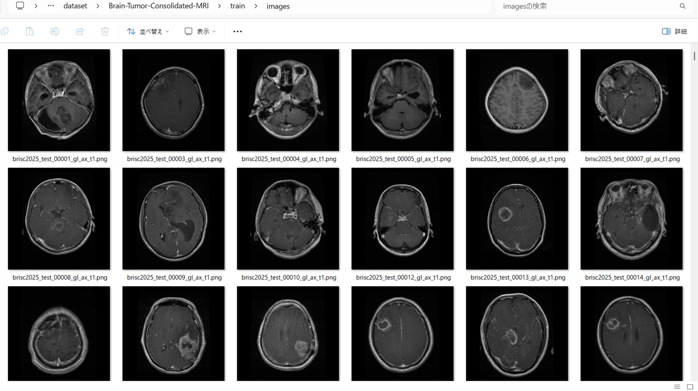
 
<b>Train_sample_masks</b> 
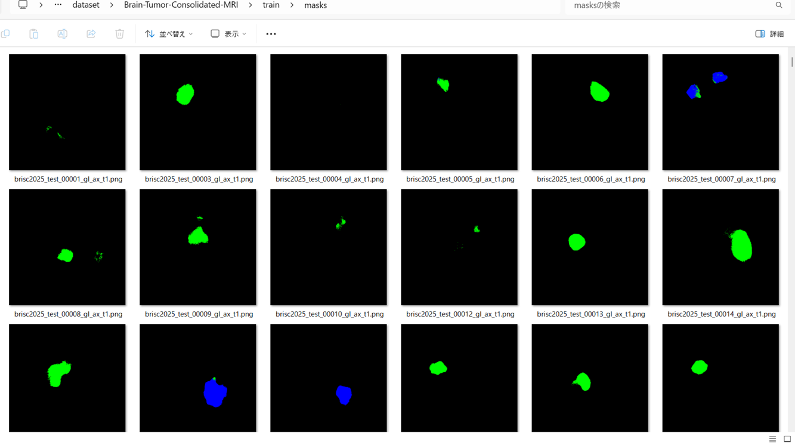
 
<h3>
3 Train TensorflowFlexUNet Model
</h3>
 We trained Brain-Tumor-Consolidated-MRI TensorflowFlexUNet Model by using the following
<a href="./projects/TensorFlowFlexUNet/Brain-Tumor-Consolidated-MRI/train_eval_infer.config"> <b>train_eval_infer.config</b></a> file.  
Please move to ./projects/TensorFlowFlexUNet/Brain-Tumor-Consolidated-MRI and run the following bat file. 
<pre>
>1.train.bat
</pre>
, which simply runs the following command. 
<pre>
>python ../../../src/TensorFlowFlexUNetTrainer.py ./train_eval_infer.config
</pre>

<b>Model parameters</b> 
Defined a small <b>base_filters=16</b> and a large <b>base_kernels=(11,11)</b> for the first Conv Layer of Encoder Block of 
<a href="./src/TensorFlowFlexUNet.py">TensorFlowFlexUNet.py</a> 
and a large num_layers (including a bridge between Encoder and Decoder Blocks).
<pre>
[model]
image_width    = 512
image_height   = 512
image_channels = 3
input_normalize = True
normalization  = False
num_classes    = 4
base_filters   = 16
base_kernels  = (11,11)
num_layers    = 8
dropout_rate   = 0.05
dilation       = (1,1)
</pre>

<b>Learning rate</b> 
Defined a small learning rate.  
<pre>
[model]
learning_rate  = 0.00007
</pre>

<b>Loss and metrics functions</b> 
Specified "categorical_crossentropy" and "dice_coef_multiclass". 
<pre>
[model]
loss           = "categorical_crossentropy"
metrics        = ["dice_coef_multiclass"]
</pre>
<b >Learning rate reducer callback</b> 
Enabled learing_rate_reducer callback, and a small reducer_patience.
<pre> 
[train]
learning_rate_reducer = True
reducer_factor     = 0.4
reducer_patience   = 4
</pre>
<b>Early stopping callback</b> 
Enabled early stopping callback with patience parameter.
<pre>
[train]
patience      = 10
</pre>
<b></b> 
<b>RGB color map</b> 
rgb color map dict for Brain-Tumor-Consolidated-MRI 1+3 classes. 
<pre>
[mask]
mask_file_format = ".png"
;Brain-Tumor-Consolidated-MRI 1+3
;                  Meningioma:blue, Glioma:green, Pituitary tumor:red      
rgb_map = {(0,0,0):0, (0,0,255):1, (0,255,0):2, (255,0,0):3,}       
</pre>
<b>Epoch change inference callbacks</b> 
Enabled epoch_change_infer callback. 
<pre>
[train]
epoch_change_infer       = True
epoch_change_infer_dir   =  "./epoch_change_infer"
epoch_changeinfer        = False
epoch_changeinfer_dir    = "./epoch_changeinfer"
num_infer_images         = 6
</pre>
By using this epoch_change_infer callback, on every epoch_change, the inference procedure can be called
 for 6 images in <b>mini_test</b> folder. This will help you confirm how the predicted mask changes 
 at each epoch during your training process.    
<b>Epoch_change_inference output at starting (1,2,3)</b> 
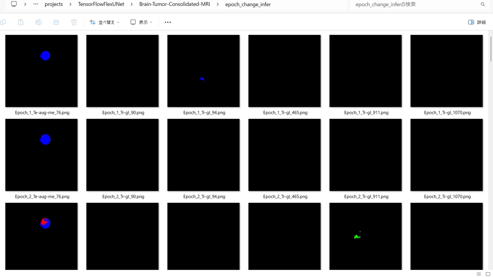 
 
<b>Epoch_change_inference output at middle-point (13,14,15)</b> 
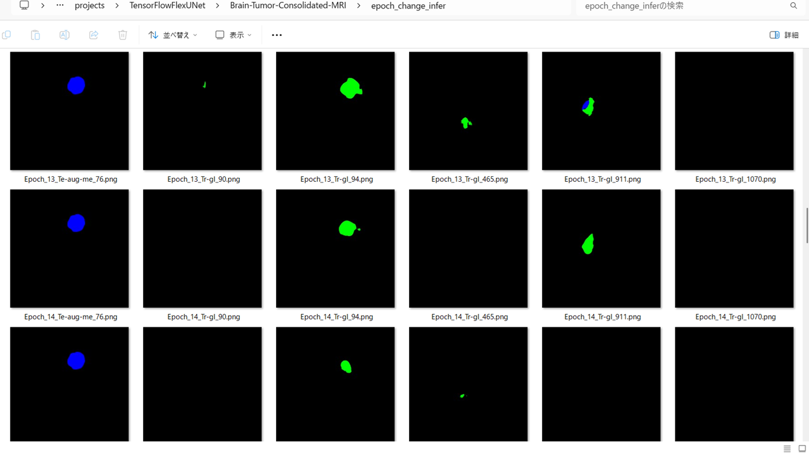 
 
<b>Epoch_change_inference output at ending (28,29,30)</b> 
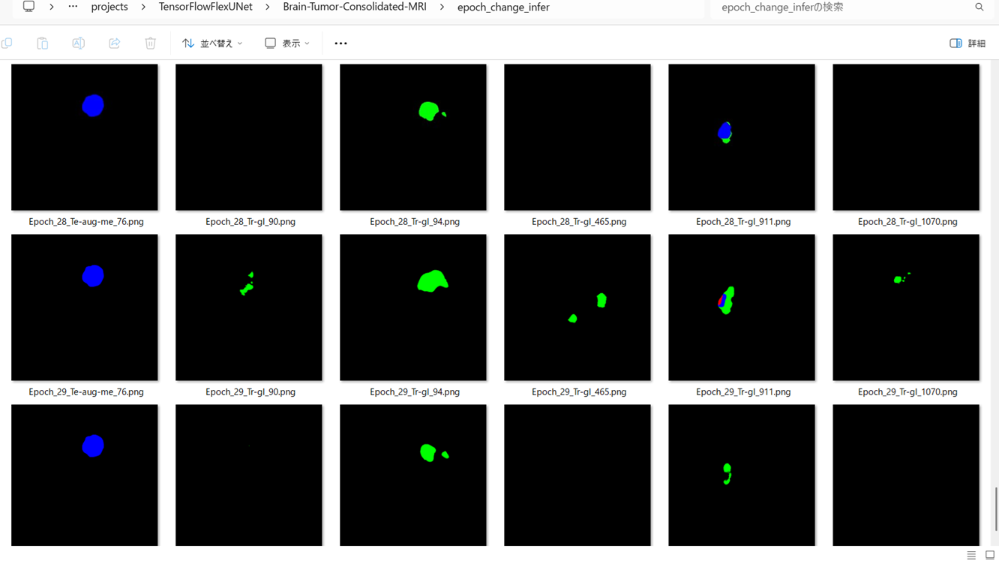 

 
In this experiment, the training process was terminated at epoch 30.  
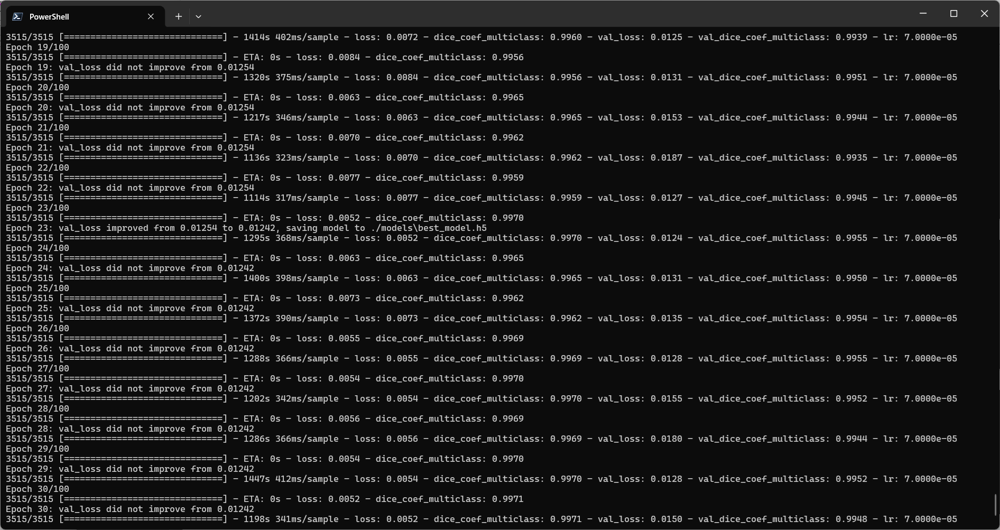 
 
<a href="./projects/TensorFlowFlexUNet/Brain-Tumor-Consolidated-MRI/eval/train_metrics.csv">train_metrics.csv</a> 
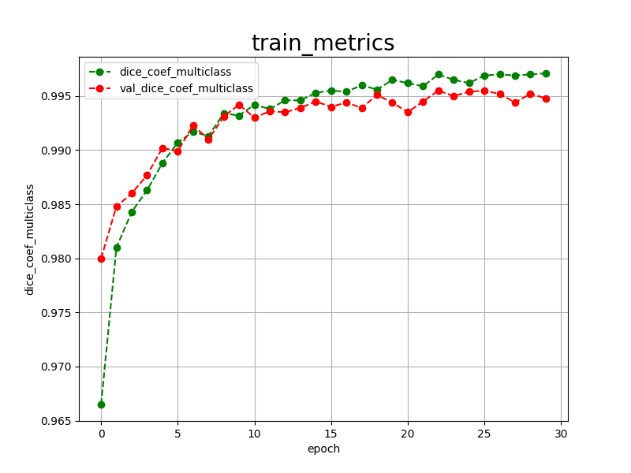 

 
<a href="./projects/TensorFlowFlexUNet/Brain-Tumor-Consolidated-MRI/eval/train_losses.csv">train_losses.csv</a> 
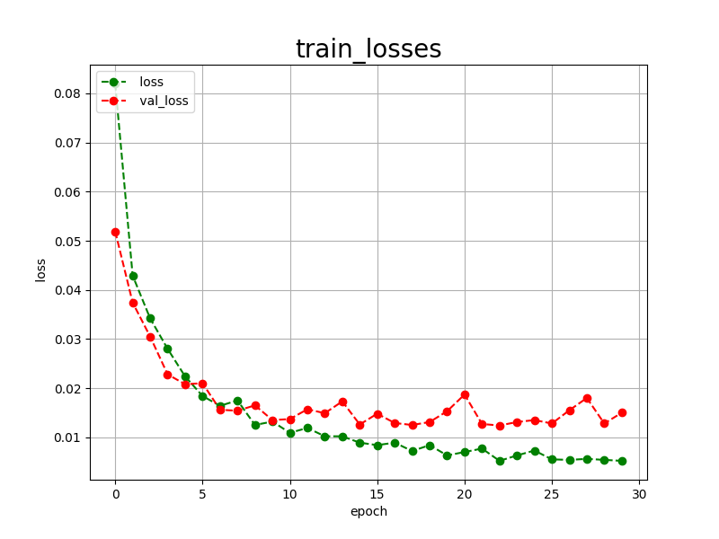 
 
<h3>
4 Evaluation
</h3>
Please move to a <b>./projects/TensorFlowFlexUNet/Brain-Tumor-Consolidated-MRI</b> folder, 
and run the following bat file to evaluate TensorflowFlexUNet model for Brain-Tumor-Consolidated-MRI. 
<pre>
>./2.evaluate.bat
</pre>
This bat file simply runs the following command.
<pre>
>python ../../../src/TensorFlowFlexUNetEvaluator.py  ./train_eval_infer.config
</pre>
Evaluation console output: 
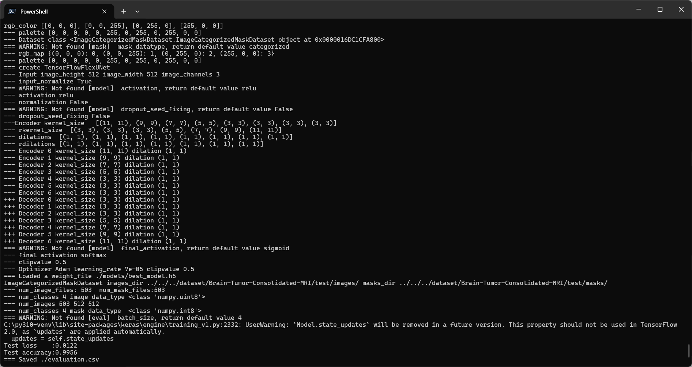
  Image-Segmentation-Brain-Tumor-Consolidated-MRI

<a href="./projects/TensorFlowFlexUNet/Brain-Tumor-Consolidated-MRI/evaluation.csv">evaluation.csv</a> 
The loss (categorical_crossentropy) to this Brain-Tumor-Consolidated-MRI/test was low, and dice_coef_multiclass high as shown below.
 
<pre>
categorical_crossentropy,0.0122
dice_coef_multiclass,0.9956
</pre>
 
<h3>5 Inference</h3>
Please move to a <b>./projects/TensorFlowFlexUNet/Brain-Tumor-Consolidated-MRI</b> folder 
,and run the following bat file to infer segmentation regions for images by the Trained-TensorflowFlexUNet model for Brain-Tumor-Consolidated-MRI. 
<pre>
>./3.infer.bat
</pre>
This simply runs the following command.
<pre>
>python ../../../src/TensorFlowFlexUNetInferencer.py ./train_eval_infer.config
</pre>

<b>mini_test_images</b> 
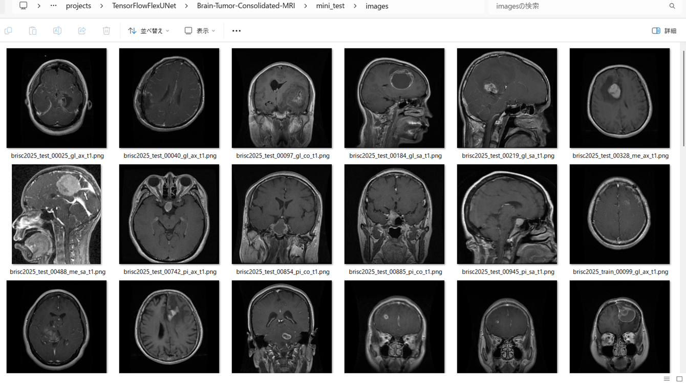 
<b>mini_test_mask(ground_truth)</b> 
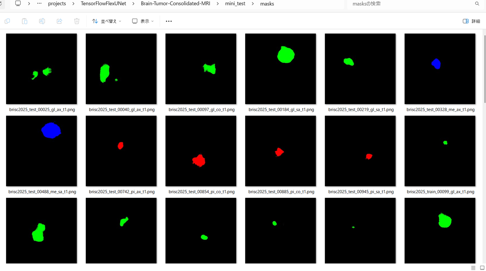 

<b>Inferred test masks</b> 
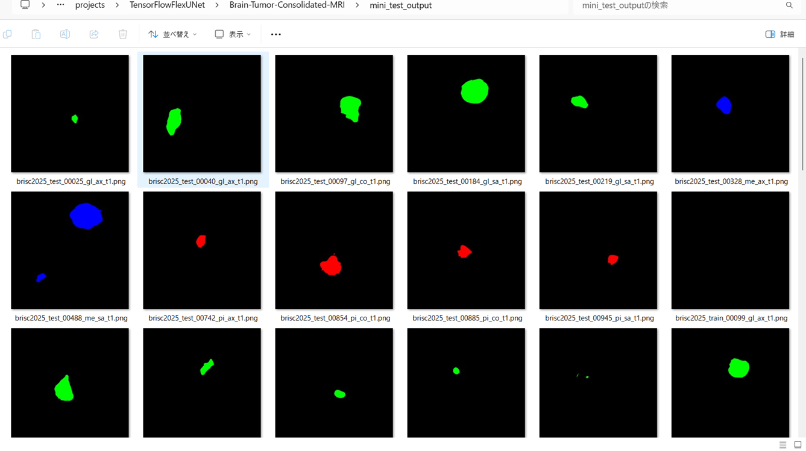 
 

<b>Enlarged images and masks for  Brain-Tumor-Consolidated-MRI  Images of 512x512 pixels</b> 
As shown below, the inferred masks predicted by our segmentation model trained by the dataset appear similar to the 
ground truth masks, excepting the fourth case. The predicted <b>red</b> polygonal region  of that case was not only 
different from the <b>green</b> ground truth shape, but also this model failed to predict the correct tumor class. 
  
<b>class_color_map = {Meningioma:blue, Glioma:green, Pituitary tumor:red}</b>
 
 
<table>
<tr>
<th>Input: image</th>
<th>Mask (ground_truth)</th>
<th>Prediction: inferred_mask</th>
</tr>
<tr>
<td>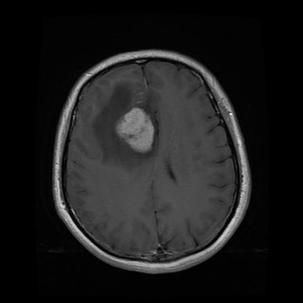</td>
<td></td>
<td></td>
</tr>

<tr>
<td>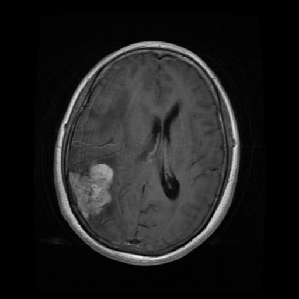</td>
<td></td>
<td></td>
</tr>

<tr>
<td>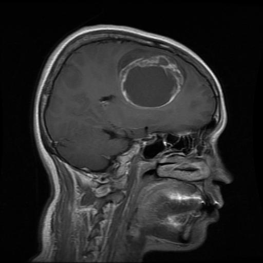</td>
<td>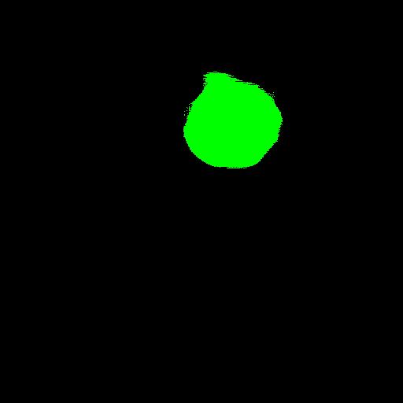</td>
<td>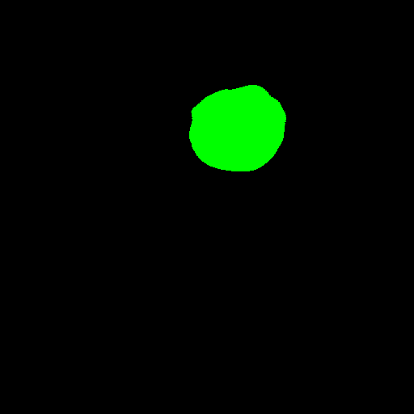</td>
</tr>
<tr>
<td>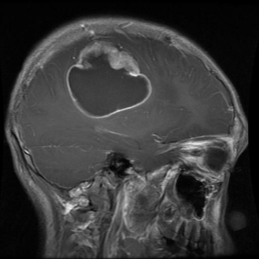</td>
<td>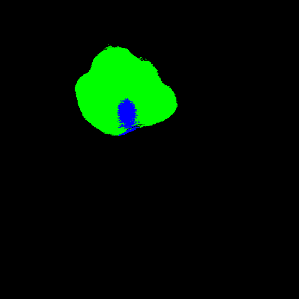</td>
<td>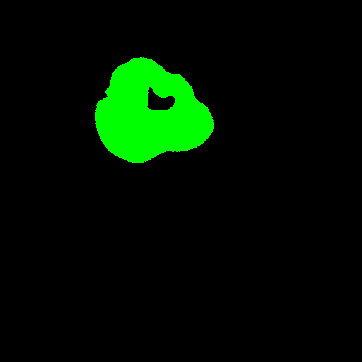</td>
</tr>
<tr>
<td>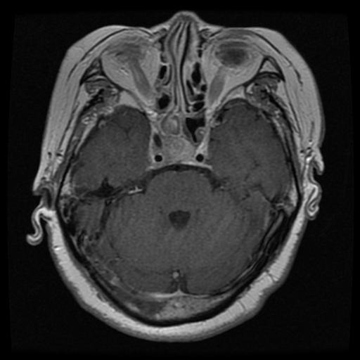</td>
<td></td>
<td></td>
</tr>
<tr>
<td>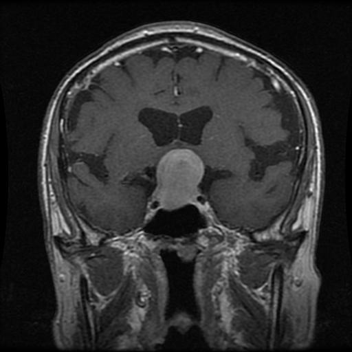</td>
<td></td>
<td>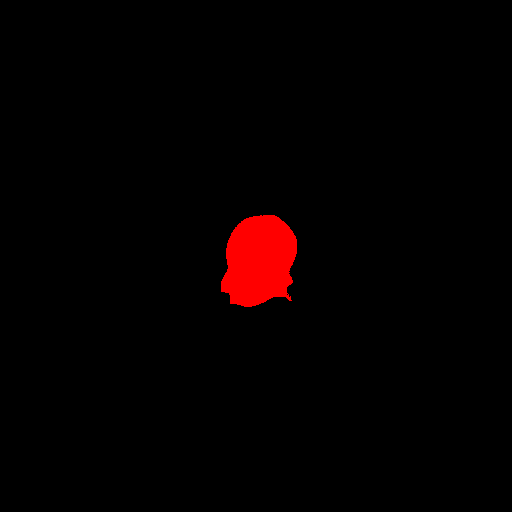</td>
</tr>
</table>

 
<h3>
References
</h3>
<b>1. TensorFlow-FlexUNet-Image-Segmentation-Crystal-Clean-Brain-Tumor</b> 
Toshiyuki Arai  
<a href="https://github.com/sarah-antillia/TensorFlow-FlexUNet-Image-Segmentation-Crystal-Clean-Brain-Tumor">
https://github.com/sarah-antillia/TensorFlow-FlexUNet-Image-Segmentation-Crystal-Clean-Brain-Tumor
</a>
 
 
<b>2. TensorFlow-FlexUNet-Image-Segmentation-Figshare-BrainTumor</b> 
Toshiyuki Arai  
<a href="https://github.com/sarah-antillia/TensorFlow-FlexUNet-Image-Segmentation-Figshare-BrainTumor">
https://github.com/sarah-antillia/TensorFlow-FlexUNet-Image-Segmentation-Figshare-BrainTumor
</a>
 
 
<b>3. TensorFlow-FlexUNet-Image-Segmentation-BRISC2026-Brain-Tumor</b> 
Toshiyuki Arai  
<a href="https://github.com/sarah-antillia/TensorFlow-FlexUNet-Image-Segmentation-BRISC2026-Brain-Tumor">
https://github.com/sarah-antillia/TensorFlow-FlexUNet-Image-Segmentation-BRISC2026-Brain-Tumor
</a>
 
 
<b>4. TensorFlow-FlexUNet-Image-Segmentation-BRISC2025-BrainTumor</b> 
Toshiyuki Arai  
<a href="https://github.com/sarah-antillia/TensorFlow-FlexUNet-Image-Segmentation-BRISC2025-BrainTumor">
https://github.com/sarah-antillia/TensorFlow-FlexUNet-Image-Segmentation-BRISC2025-BrainTumor
</a>
 
 
<b>5. TensorFlow-FlexUNet-Image-Segmentation-Brain-Tumor-MRI </b> 
Toshiyuki Arai  
<a href="https://github.com/sarah-antillia/TensorFlow-FlexUNet-Image-Segmentation-Brain-Tumor-MRI">
https://github.com/sarah-antillia/TensorFlow-FlexUNet-Image-Segmentation-Brain-Tumor-MRI
</a>
 
 
<b>6. TensorFlow-FlexUNet-Image-Segmentation-Model</b> 
Toshiyuki Arai  
<a href="https://github.com/sarah-antillia/TensorFlow-FlexUNet-Image-Segmentation-Model">
TensorFlow-FlexUNet-Image-Segmentation-Model
</a>
 
 
